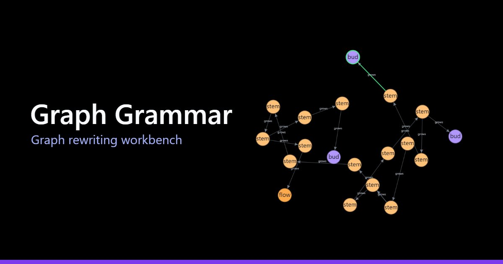
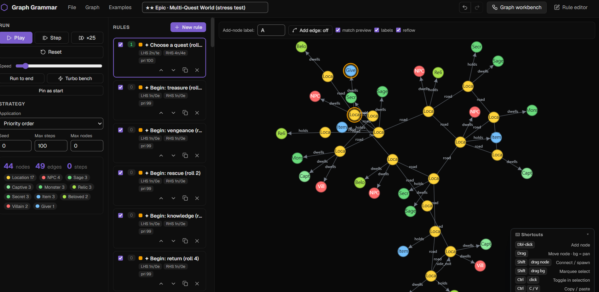

# Graph Grammar


[](https://github.com/Kiberon-Labs/graph-grammar/actions/workflows/native-release.yml)




A **graph rewriting** (graph grammar) engine and an interactive workbench for it.

See the [documentation site](https://gg.kiberonlabs.com) for more information, examples and a UI




Author rewrite rules with a left-hand-side *pattern* and a right-hand-side *result*,
draw the morphism that connects them, then watch the rules iteratively transform a
host graph.

This repository is a **pnpm-workspaces monorepo** with four parts , two of them
published to npm:

| Path | Package | What it is |
| --- | --- | --- |
| `packages/graph-grammar` | **`graph-grammar`** (published) | The framework-agnostic engine. Matching, rewriting, strategies, serialization. Only runtime dep is `zod`. |
| `packages/graph-grammar-react` | **`graph-grammar-react`** (published) | The embeddable React editor , the full visual workbench as a component, plus building blocks. Re-exports the engine. |
| `packages/graph-grammar-native` | **`graph-grammar-native`** | The graph grammar system available as an embeddable .dll  |
| `apps/web` | `@graph-grammar/web` (private) | A thin demo shell that mounts the editor. |
| `docs` | `@graph-grammar/docs` (private) | The documentation site (Astro + Starlight). |

Pick what you need:

```sh
npm install graph-grammar          # just the engine (headless)
npm install graph-grammar-react    # the embeddable visual editor (pulls in the engine)
```

### Working in this repo

This repo uses **pnpm** (`corepack enable` to get it from the `packageManager` field).

```sh
pnpm install           # install all workspaces

pnpm dev               # run the workbench (apps/web Vite dev server)
pnpm dev:docs          # run the docs site (Astro)

pnpm build:lib         # build the engine (tsup → ESM + d.ts)
pnpm build:editor      # build the React editor (tsup → ESM + d.ts + styles.css)
pnpm build             # build everything: engine, editor, app, docs
pnpm test              # run the engine's Vitest suite
pnpm typecheck         # type-check engine, editor, and app
```

The demo app and the editor consume the engine directly from source (via Vite
aliases), so no pre-build is needed to run things during development.
